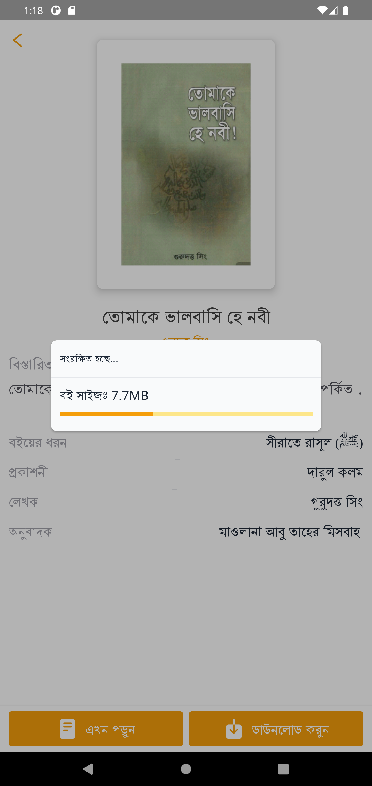

<div id="top"></div>
<!-- PROJECT LOGO -->
<br />

<div align="center">
  <a href="https://github.com/OmarFaruk-0x01/IQRABook" > 
    
  </a>

<div>

<!-- ## **IQRA Book** -->
  <p align="center">
    IQRABook is a book reader app made for Book lovers <br />
    <br />
    <a href="https://github.com/OmarFaruk-0x01/IQRABook/issues">Report Bug</a>
    ·
    <a href="https://github.com/OmarFaruk-0x01/IQRABook/issues">Request Feature</a>
  </p>
</div>
</div>


<!-- TABLE OF CONTENTS -->
<details open >
  <summary style="cursor: pointer;">Table of Contents</summary>
  <ol>
    <li>
      <a href="#about-the-project">About The Project</a>
      <ul>
        <li><a href="#features-with-snapshots">Features with Snapshots</a></li>
        <li><a href="#built-with">Built With</a></li>
      </ul>
    </li>
        <li><a href="#prerequisites">Prerequisites</a></li>
    <li>
      <a href="#installation">Installation</a>
      <ul>
        <li><a href="#frontend">Frontend</a></li>
        <li><a href="#backend">Backend</a></li>
      </ul>
    </li>
    <li>
      <a href="#setup_run">Setup & Run</a>
    </li>
    
   
  </ol>
</details>


<!-- ABOUT THE PROJECT -->
## About The Project
<div align="center">

</div><br>
IQRABook is an Islamic Book Reader app made for book lovers with awesome features e.g. <b>Clean UI</b>, <b>Offline Download</b>, <b>Online Reading</b>, <b>Filter Cetegory</b>, <b>AutoSave Previous Reading</b>, etc. The app was made with React Native as a Frontend Technology and Google Sheet as a Backend Technology. The app will help book lovers a lot. Book lovers can easily get their books and read.
<p align="right">(<a href="#top">back to top</a>)</p>

## Features with Snapshots
1. **Filter Categorized Books** 
   <details style="cursor: pointer;" ><summary>snapshot</summary>

   

   </details>
2. **Online Reading & Offline Reading** 
   <details style="cursor: pointer;" ><summary>snapshot</summary>

   

   </details>
3. **Download Books**
   <details style="cursor: pointer;" ><summary>snapshot</summary>

   

   </details>
4. **AutoSave Previous Reading**
   <details style="cursor: pointer;"><summary>snapshot</summary>

   
   

   </details>
5. **Students can save search results in offline**
   <details style="cursor: pointer;" ><summary>snapshot</summary>

    
   
   </details>
   
6. **Save Favourite Books**
   <details style="cursor: pointer;"><summary>snapshot</summary>

    
   
   </details>
## Built With 
#### Frontend Technology  
* [React Native](https://reactnative.dev/)
* [Redux Toolkit](https://redux-toolkit.js.org/)
* [Native Base UI](https://nativebase.io/)


#### Backend Technology  
* [Google Sheet API]() 

<p align="right">(<a href="#top">back to top</a>)</p>


## Prerequisites
There are some prerequisites to run this app and server

* **NPM**
  
  Follow the instruction to install [node-js & npm](https://nodejs.org/de/download/package-manager/)

* **React Native**

  React native has a greate [documentation](https://reactnative.dev/docs/environment-setup) for enviroment setup 


## Installation
### Frontend
1. Clone the repo
     ```sh
   git clone https://github.com/OmarFaruk-0x01/IQRABook
   ```
2. Install NPM packages
   ```sh
   npm install
   ```


### Backend
Follow the official documentation of [Google Sheet](https://developers.google.com/sheets/api/guides/concepts)

<p align="right">(<a href="#top">back to top</a>)</p>


<!-- Setup Projects -->
<div id="setup_run"></div>

## Setup & Run
Now you have to run some commands to start the app.
### Frontend
1. To run the application
   ```sh
   npx react-native run-android # 'run-ios' if you are in macOS
   ```
2. To start the developement server
   ```sh
   npx react-native start
   ```
3. To make a Release Build follow [the article][release_build_article].
   
### Backend
Use those commands to run the backend server.
1. Configure Google Sheet API with your app. 
   goto this path `src/Constants/Fetcher.js` and set your API KEY
   ```js
   const APIKEY = '<Your APIKEY>';
   ```


<p align="right">(<a href="#top">back to top</a>)</p>


[release_build_article]: https://instamobile.io/android-development/generate-react-native-release-build-android/